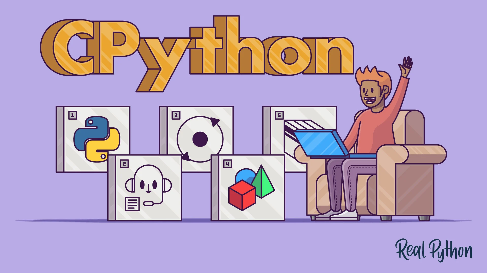

<div align="center">
<br>



</div>


<p align="center">


</p>


<h1 align="center"> CPython </h1>


<h3 align="center">
<a href="https://github.com/RazikaBengana/holbertonschool-system_linux/tree/main/0x08_CPython#eye-about">About</a> •
<a href="https://github.com/RazikaBengana/holbertonschool-system_linux/tree/main/0x08_CPython#hammer_and_wrench-tasks">Tasks</a> •
<a href="https://github.com/RazikaBengana/holbertonschool-system_linux/tree/main/0x08_CPython#computer-requirements">Requirements</a> •
<a href="https://github.com/RazikaBengana/holbertonschool-system_linux/tree/main/0x08_CPython#bust_in_silhouette-authors">Authors</a> •
<a href="https://github.com/RazikaBengana/holbertonschool-system_linux/tree/main/0x08_CPython#octocat-license">License</a>
</h3>

---

<!-- ------------------------------------------------------------------------------------------------- -->

<br>
<br>

## :eye: About

<br>

<div align="center">

**`CPython`** project focuses on exploring and manipulating `Python` objects using `C` code.
<br>
The programs implement functions to print detailed information about various `Python` data structures such as **lists**, **bytes**, **floats**, **tuples**, and **dictionaries**.
<br>
<br>
This project has been created by **[Holberton School](https://www.holbertonschool.com/about-holberton)** to enable every student to understand **how `Python` objects are represented and managed at a lower level**, with `CPython`.

</div>

<br>
<br>

<!-- ------------------------------------------------------------------------------------------------- -->

## :hammer_and_wrench: Tasks

<br>

**`0. Lists big O`**

**`1. CPython #0: Python lists`**

**`2. CPython #1: PyBytesObject`**

**`3. CPython #2: PyFloatObject`**

**`4. CPython #3: Python Strings`**

**`5. CPython Integers`**

**`6. CPython Integers (2)`**

<br>
<br>

<!-- ------------------------------------------------------------------------------------------------- -->

## :computer: Requirements

<br>

```diff

General

+ Allowed editors: vi, vim, emacs

+ All your files will be compiled on Ubuntu 20.04 LTS

+ All your files should end with a new line

+ A README.md file, at the root of the folder of the project is mandatory

```

<br>

**_Why all your files should end with a new line? See [HERE](https://unix.stackexchange.com/questions/18743/whats-the-point-in-adding-a-new-line-to-the-end-of-a-file/18789)_**

<br>
<br>

### Big O Notation in Answer File

<br>

- `O(1)`
- `O(n)`
- `O(n!)`
- n square -> `O(n^2)`
- log(n) -> `O(log(n))`
- n * log(n) -> `O(nlog(n))`
- Please use the “short” notation (don’t use constants)
- All your answers files must have an empty line at the end

<br>
<br>

<!-- ------------------------------------------------------------------------------------------------- -->

## :bust_in_silhouette: Authors

<br>


<br>
<br>

<!-- ------------------------------------------------------------------------------------------------- -->

## :octocat: License

<br>

```CPython``` _project has no license specified._

<br>
<br>

---

<p align="center"><br>2023</p>