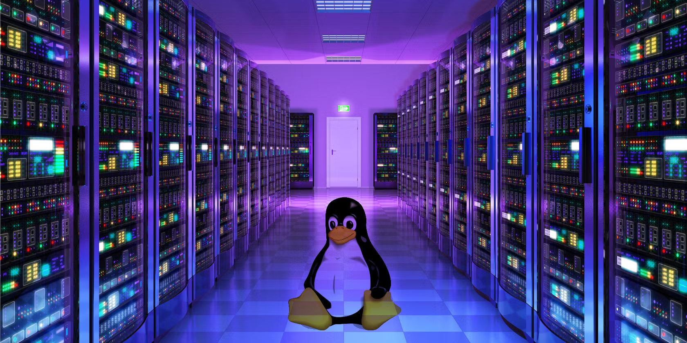

 

 

<h1 align="center">holbertonschool-system_linux</h1>

 

- ### **[00 - C - ls](https://github.com/RazikaBengana/holbertonschool-system_linux/tree/main/ls)**
- ### **[01 - C - Static variables, getline](https://github.com/RazikaBengana/holbertonschool-system_linux/tree/main/getline)**

 

---

 

- ### **[02 - Python - /proc filesystem](https://github.com/RazikaBengana/holbertonschool-system_linux/tree/main/proc_filesystem)**

 

---

 

- ### **[03 - C - ELF: readelf](https://github.com/RazikaBengana/holbertonschool-system_linux/tree/main/readelf)**

 

---

 

- ### **[04 - x86 Assembly - libASM](https://github.com/RazikaBengana/holbertonschool-system_linux/tree/main/libasm)**

 

---

 

- ### **[05 - C - Signals](https://github.com/RazikaBengana/holbertonschool-system_linux/tree/main/signals)**
- ### **[06 - C - ELF: nm/objdump](https://github.com/RazikaBengana/holbertonschool-system_linux/tree/main/nm_objdump)**

 

---

 

- ### **[07 - CPython](https://github.com/RazikaBengana/holbertonschool-system_linux/tree/main/0x08_CPython)**

 

---

 

- ### **[08 - C - Strace](https://github.com/RazikaBengana/holbertonschool-system_linux/tree/main/strace)**

 

---

 

- ### **[09 - Multithreading](https://github.com/RazikaBengana/holbertonschool-system_linux/tree/main/multithreading)**

 

---

 

- ### **[10 - Sockets](https://github.com/RazikaBengana/holbertonschool-system_linux/tree/main/sockets)**