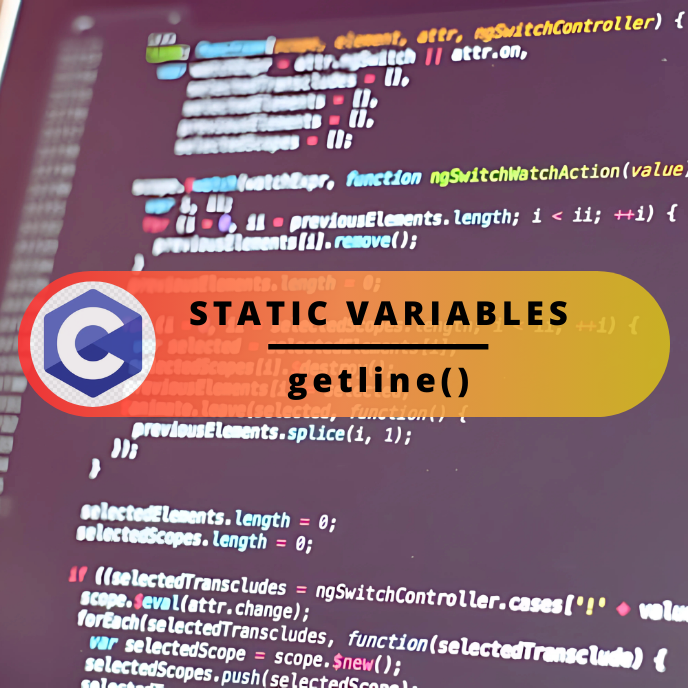

<div align="center">
<br>



</div>


<p align="center">


</p>


<h1 align="center"> C - Static variables, getline </h1>


<h3 align="center">
<a href="https://github.com/RazikaBengana/holbertonschool-system_linux/tree/main/getline#eye-about">About</a> •
<a href="https://github.com/RazikaBengana/holbertonschool-system_linux/tree/main/getline#hammer_and_wrench-tasks">Tasks</a> •
<a href="https://github.com/RazikaBengana/holbertonschool-system_linux/tree/main/getline#memo-learning-objectives">Learning Objectives</a> •
<a href="https://github.com/RazikaBengana/holbertonschool-system_linux/tree/main/getline#computer-requirements">Requirements</a> •
<a href="https://github.com/RazikaBengana/holbertonschool-system_linux/tree/main/getline#mag_right-resources">Resources</a> •
<a href="https://github.com/RazikaBengana/holbertonschool-system_linux/tree/main/getline#bust_in_silhouette-authors">Authors</a> •
<a href="https://github.com/RazikaBengana/holbertonschool-system_linux/tree/main/getline#octocat-license">License</a>
</h3>

---

<!-- ------------------------------------------------------------------------------------------------- -->

<br>
<br>

## :eye: About

<br>

<div align="center">

**`C - static variables, getline`** project implements a custom `_getline` function to read lines from file descriptors and a race simulation system using linked lists, demonstrating advanced C programming concepts.
<br>
The programs include functionality for reading input from file descriptors, managing a car race simulation with dynamic data structures, and utilizing `static variables` for efficient memory management.
<br>
<br>
This project has been created by **[Holberton School](https://www.holbertonschool.com/about-holberton)** to enable every student to understand how `static variables` and `custom input functions` in C language work.

</div>

<br>
<br>

<!-- ------------------------------------------------------------------------------------------------- -->

## :hammer_and_wrench: Tasks

<br>

**`0. Racing cars`**

**`1. _getline`**

**`2. _getline: multi-fd`**

**`3. _getline: ^@`**

<br>
<br>

<!-- ------------------------------------------------------------------------------------------------- -->

## :memo: Learning Objectives

<br>

**_You are expected to be able to [explain to anyone](https://fs.blog/feynman-learning-technique/), without the help of Google:_**

<br>

```diff

General

+ What are static variables?

+ How and when to use them?

```

<br>
<br>

<!-- ------------------------------------------------------------------------------------------------- -->

## :computer: Requirements

<br>

```diff

General

+ Allowed editors: vi, vim, emacs

+ All your files will be compiled on Ubuntu 20.04 LTS

+ Your C programs and functions will be compiled with gcc 9.4.0 using the flags -Wall -Werror -Wextra and -pedantic

+ All your files should end with a new line

+ A README.md file, at the root of the folder of the project is mandatory

+ Your code should use the Betty style. It will be checked using betty-style.pl and betty-doc.pl

+ All your header files should be include guarded

+ You are allowed to have up to 6 functions in _getline.c

```

<br>

**_Why all your files should end with a new line? See [HERE](https://unix.stackexchange.com/questions/18743/whats-the-point-in-adding-a-new-line-to-the-end-of-a-file/18789)_**

<br>
<br>

### List of allowed Functions and System Calls

<br>

- `read`
- `write`
- `malloc`
- `realloc`
- `free`
- `strcpy`
- `strncpy`
- `strcat`
- `strdup`
- `memset`
- `memcpy`

<br>
<br>

<!-- ------------------------------------------------------------------------------------------------- -->

## :mag_right: Resources

<br>

**_Do you need some help?_**

<br>

**Read or watch:**

* [C - Static Variables](https://www.geeksforgeeks.org/static-variables-in-c/)

* [Google](https://www.google.com/)

<br>
<br>

<!-- ------------------------------------------------------------------------------------------------- -->

## :bust_in_silhouette: Authors

<br>


<br>
<br>

<!-- ------------------------------------------------------------------------------------------------- -->

## :octocat: License

<br>

```C - static variables, getline``` _project has no license specified._

<br>
<br>

---

<p align="center"><br>2023</p>