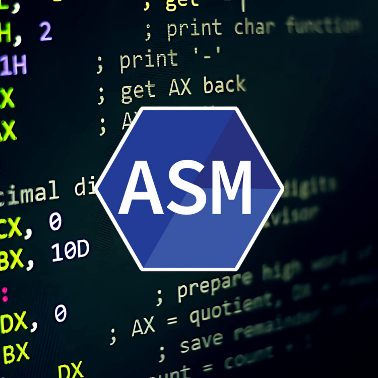

<div align="center">
<br>



</div>


<p align="center">


</p>


<h1 align="center"> x86 Assembly - libASM </h1>


<h3 align="center">
<a href="https://github.com/RazikaBengana/holbertonschool-system_linux/tree/main/libasm#eye-about">About</a> •
<a href="https://github.com/RazikaBengana/holbertonschool-system_linux/tree/main/libasm#hammer_and_wrench-tasks">Tasks</a> •
<a href="https://github.com/RazikaBengana/holbertonschool-system_linux/tree/main/libasm#memo-learning-objectives">Learning Objectives</a> •
<a href="https://github.com/RazikaBengana/holbertonschool-system_linux/tree/main/libasm#computer-requirements">Requirements</a> •
<a href="https://github.com/RazikaBengana/holbertonschool-system_linux/tree/main/libasm#mag_right-resources">Resources</a> •
<a href="https://github.com/RazikaBengana/holbertonschool-system_linux/tree/main/libasm#bust_in_silhouette-authors">Authors</a> •
<a href="https://github.com/RazikaBengana/holbertonschool-system_linux/tree/main/libasm#octocat-license">License</a>
</h3>

---

<!-- ------------------------------------------------------------------------------------------------- -->

<br>
<br>

## :eye: About

<br>

<div align="center">

**`x86 Assembly - libASM`** project focuses on implementing standard `C` library functions in `x86-64 assembly` language.
<br>
The programs include low-level implementations of string manipulation, memory operations, and output functions, demonstrating the intricacies of `assembly` programming and its direct interaction with hardware.
<br>
<br>
This project has been created by **[Holberton School](https://www.holbertonschool.com/about-holberton)** to enable every student to understand how fundamental `C library functions` operate at the **machine level** with `ASM`, bridging the gap between high-level `C` code and low-level system operations.

</div>

<br>
<br>

<!-- ------------------------------------------------------------------------------------------------- -->

## :hammer_and_wrench: Tasks

<br>

**`0. strlen`**

**`1. strcmp`**

**`2. strncmp`**

**`3. strchr`**

**`4. strstr`**

**`5. memcpy`**

**`6. putc`**

**`7. puts`**

**`8. strcasecmp`**

**`9. strncasecmp`**

**`10. strspn`**

**`11. strcspn`**

**`12. strpbrk`**

**`13. puti`**

**`14. puti_base`**

<br>
<br>

<!-- ------------------------------------------------------------------------------------------------- -->

## :memo: Learning Objectives

<br>

**_You are expected to be able to [explain to anyone](https://fs.blog/feynman-learning-technique/), without the help of Google:_**

<br>

```diff

General

+ The differences between Intel and AT&T syntaxes

+ The different x86 GPR

+ The different flag registers

+ What is a stack frame

+ How to setup a stack frame

+ How to call a function

+ How to make a system call

+ How to pass parameters to a function

+ How to retrieve parameters

```

<br>
<br>

<!-- ------------------------------------------------------------------------------------------------- -->

## :computer: Requirements

<br>

```diff

General

+ Allowed editors: vi, vim, emacs

+ All your files will be compiled on Ubuntu 20.04 LTS

+ Your ASM programs and functions will be compiled with NASM version 2.14.02 using the flags -f elf64

+ All your files should end with a new line

+ A README.md file, at the root of the folder of the project, is mandatory

+ The prototypes of all your functions should be included in your header file called libasm.h

+ Don’t forget to push your header files

+ All your header files should be include guarded


Allowed Functions and System Calls

- Unless specified otherwise, you are NOT allowed to do any call or make any system call. It means you’re not allowed to use either the call nor the syscall instructions.

```

<br>

**_Why all your files should end with a new line? See [HERE](https://unix.stackexchange.com/questions/18743/whats-the-point-in-adding-a-new-line-to-the-end-of-a-file/18789)_**

<br>
<br>

<!-- ------------------------------------------------------------------------------------------------- -->

## :mag_right: Resources

<br>

**_Do you need some help?_**

<br>

**Concepts:**

* ASM concept page

* [[EYNTK] x86-64 Assembly](https://drive.google.com/file/d/12ateVUjBKT3exOK7-ScdUpqZD76-nFuV/view?usp=sharing)

<br>

**Read or watch:**

* [x86 Assembly Language](https://en.wikipedia.org/wiki/X86_assembly_language)

* [x86 Registers](https://en.wikipedia.org/wiki/X86#x86_registers)

* [x86 Architecture](https://en.wikibooks.org/wiki/X86_Assembly/X86_Architecture)

* [Intel instructions](https://stackoverflow.com/questions/17865156/where-can-i-find-a-list-of-x86-64-assembly-instructions)

<br>
<br>

<!-- ------------------------------------------------------------------------------------------------- -->

## :bust_in_silhouette: Authors

<br>


<br>
<br>

<!-- ------------------------------------------------------------------------------------------------- -->

## :octocat: License

<br>

```x86 Assembly - libASM``` _project has no license specified._

<br>
<br>

---

<p align="center"><br>2023</p>