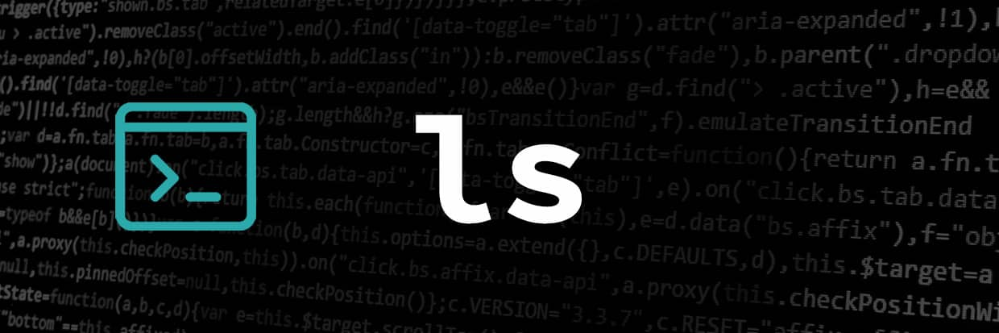

<div align="center">
<br>



</div>

<p align="center">


</p>


<h1 align="center"> C - ls </h1>


<h3 align="center">
<a href="https://github.com/RazikaBengana/holbertonschool-system_linux/tree/main/ls#eye-about">About</a> •
<a href="https://github.com/RazikaBengana/holbertonschool-system_linux/tree/main/ls#hammer_and_wrench-tasks">Tasks</a> •
<a href="https://github.com/RazikaBengana/holbertonschool-system_linux/tree/main/ls#memo-learning-objectives">Learning Objectives</a> •
<a href="https://github.com/RazikaBengana/holbertonschool-system_linux/tree/main/ls#computer-requirements">Requirements</a> •
<a href="https://github.com/RazikaBengana/holbertonschool-system_linux/tree/main/ls#keyboard-more-info">More Info</a> •
<a href="https://github.com/RazikaBengana/holbertonschool-system_linux/tree/main/ls#mag_right-resources">Resources</a> •
<a href="https://github.com/RazikaBengana/holbertonschool-system_linux/tree/main/ls#bust_in_silhouette-authors">Authors</a> •
<a href="https://github.com/RazikaBengana/holbertonschool-system_linux/tree/main/ls#octocat-license">License</a>
</h3>

---

<!-- ------------------------------------------------------------------------------------------------- -->

<br>
<br>

## :eye: About

<br>

<div align="center">

**`C - ls`** project is a basic custom implementation of the Unix `ls` command, written in `C`, designed to list directory contents and display file information.
<br>
The program includes functionality for processing command-line options, listing directory contents, displaying file permissions, and performing string manipulations, all compiled into an executable named `hls` using a `Makefile`.
<br>
<br>
This project has been created by **[Holberton School](https://www.holbertonschool.com/about-holberton)** to enable every student to understand how `low-level system programming` and `file system operations` in C language work.

</div>

<br>
<br>

<!-- ------------------------------------------------------------------------------------------------- -->

## :hammer_and_wrench: Tasks

<br>

**`0. Let's start with something simple!`**

**`1. Maybe some parameters?`**

**`2. What about options?`**

**`3. Hidden files`**

**`4. Almost all`**

**`5. More details`**

**`6. Mixing options`**

**`7. Esrever`**

**`8. More sorting?`**

**`9. I know you like sorting things.`**

**`10. The Juggernaut`**

<br>
<br>

<!-- ------------------------------------------------------------------------------------------------- -->

## :memo: Learning objectives

<br>

**_You are expected to be able to [explain to anyone](https://fs.blog/feynman-learning-technique/), without the help of Google:_**

<br>

```diff

General

+ How does ls work?

+ What are all the functions used by ls?

```

<br>
<br>

<!-- ------------------------------------------------------------------------------------------------- -->

## :computer: Requirements

<br>

```diff

General

+ Allowed editors: vi, vim, emacs

+ All your files will be compiled on Ubuntu 20.04 LTS

+ Your C programs and functions will be compiled with gcc 9.4.0 using the flags -Wall -Werror -Wextra and -pedantic

+ All your files should end with a new line

+ A README.md file, at the root of the folder of the project is mandatory

+ Your code should use the Betty style. It will be checked using betty-style.pl and betty-doc.pl

+ No more than 5 functions per file

+ All your header files should be include guarded

+ Valgrind should show 0 memory leak and 0 error

+ Unless specified otherwise, your program must have the exact same output as ls as well as the exact same error output - except for alignment.

```

<br>

**_Why all your files should end with a new line? See [HERE](https://unix.stackexchange.com/questions/18743/whats-the-point-in-adding-a-new-line-to-the-end-of-a-file/18789)_**

<br>
<br>

<!-- ------------------------------------------------------------------------------------------------- -->

## :keyboard: More Info

<br>

### List of allowed Functions and System Calls:

<br>

- `opendir` (`man 3 opendir`)
- `readdir` (`man 3 readdir`)
- `closedir` (`man 3 closedir`)
- `exit` (`man 3 exit`)
- `free` (`man 3 free`)
- `lstat` (`man 2 lstat`)
- `malloc` (`man 3 malloc`)
- `perror` (`man 3 perror`)
- `write` (`man 2 write`)
- `printf` (`man 3 printf`)
- `sprintf` (`man 3 sprintf`)
- `fprintf` (`man 3 fprintf`)
- `readlink` (`man 2 readlink`)
- `ctime` (`man 3 ctime`)
- `getpwuid` (`man 3 getpwuid`)
- `getgrgid` (`man 3 getgrgid`)
- `errno` (`man 3 errno`)

<br>
<br>

### Compilation:

<br>

- Your program will be compiled this way:

<br>

```yaml
gcc -Wall -Werror -Wextra -pedantic *.c -o hls
```

<br>

Every task depends on the previous ones. <br>
We strongly encourage you to read the entire project and think about the way you are going to design your entire ls before starting. <br>
This is actually something you should do all the time :). <br>

<br>
<br>

### Testing:

<br>

- Your program should give the same result as the real `ls`:

<br>

```yaml
$ ls test
abc  BCD  file  file2  file3  folder1  folder2  folder3
$ ./hls test
abc  BCD  file  file2  file3  folder1  folder2  folder3
$ ls -1
abc
BCD
file
file2
file3
folder1
folder2
folder3
hls
$ ./hls -1
abc
BCD
file
file2
file3
folder1
folder2
folder3
hls
$
```

<br>
<br>

### Details:

<br>

- For all tasks of this project, unless explicitly said otherwise:

    - You don’t have to worry about the spacing
    - You don’t have to worry about the sorting

<br>
<br>

<!-- ------------------------------------------------------------------------------------------------- -->

## :mag_right: Resources

<br>

**_Do you need some help?_**

<br>

**Concepts:**

* Everything you need to know to write your own ls

* [[EYNTK] Create your own ls](https://drive.google.com/file/d/11IazBB9QBnzHmuDd4cPpRMOjzLDVnrpN/view?usp=sharing)

<br>

**`man` or `help`:**

* `man ls`

<br>
<br>

<!-- ------------------------------------------------------------------------------------------------- -->

## :bust_in_silhouette: Authors

<br>

**${\color{blue}Razika \space Bengana}$**

<br>
<br>

<!-- ------------------------------------------------------------------------------------------------- -->

## :octocat: License

<br>

```C - ls``` _project has no license specified._

<br>
<br>

---

<p align="center"><br>2023</p>