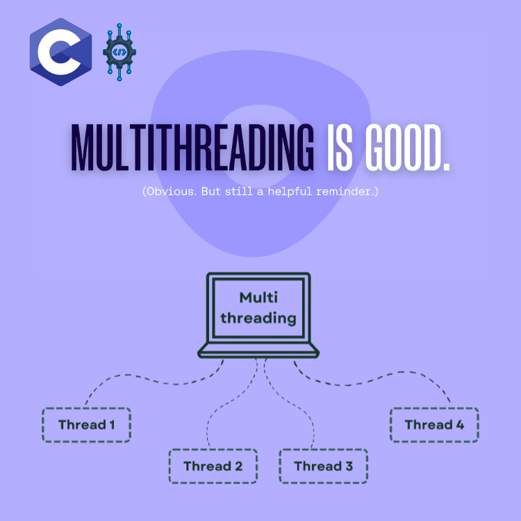

<div align="center">
<br>



</div>


<p align="center">


</p>


<h1 align="center"> Multithreading </h1>


<h3 align="center">
<a href="https://github.com/RazikaBengana/holbertonschool-system_linux/tree/main/multithreading#eye-about">About</a> •
<a href="https://github.com/RazikaBengana/holbertonschool-system_linux/tree/main/multithreading#hammer_and_wrench-tasks">Tasks</a> •
<a href="https://github.com/RazikaBengana/holbertonschool-system_linux/tree/main/multithreading#memo-learning-objectives">Learning Objectives</a> •
<a href="https://github.com/RazikaBengana/holbertonschool-system_linux/tree/main/multithreading#computer-requirements">Requirements</a> •
<a href="https://github.com/RazikaBengana/holbertonschool-system_linux/tree/main/multithreading#mag_right-resources">Resources</a> •
<a href="https://github.com/RazikaBengana/holbertonschool-system_linux/tree/main/multithreading#bust_in_silhouette-authors">Authors</a> •
<a href="https://github.com/RazikaBengana/holbertonschool-system_linux/tree/main/multithreading#octocat-license">License</a>
</h3>

---

<!-- ------------------------------------------------------------------------------------------------- -->

<br>
<br>

## :eye: About

<br>

<div align="center">

**`Multithreading`** project focuses on implementing **concurrent programming techniques** in `C`.
<br>
The programs demonstrate various aspects of `multithreading`, including thread-safe output, parallel image processing, prime factorization using multiple threads, and managing tasks in a multithreaded environment.
<br>
<br>
This project has been created by **[Holberton School](https://www.holbertonschool.com/about-holberton)** to enable every student to understand how `concurrent execution` and `synchronization in multi-core systems` in C language work.

</div>

<br>
<br>

<!-- ------------------------------------------------------------------------------------------------- -->

## :hammer_and_wrench: Tasks

<br>

**`0. Thread entry point`**

**`1. Thread Logger`**

**`2. Blur portion of an image`**

**`3. Blur entire image`**

**`4. Thread logger v2`**

**`5. Number to prime factors`**

**`6. Number to prime factors v2`**

<br>
<br>

<!-- ------------------------------------------------------------------------------------------------- -->

## :memo: Learning objectives

<br>

**_You are expected to be able to [explain to anyone](https://fs.blog/feynman-learning-technique/), without the help of Google:_**

<br>

```diff

General

+ What is a thread

+ What are the differences between a thread and a process

+ What is the difference between Concurrency and Parallelism

+ How to create a thread

+ How to properly exit a thread

+ How to handle mutual execution

+ What is a deadlock

+ What is a race condition

```

<br>
<br>

<!-- ------------------------------------------------------------------------------------------------- -->

## :computer: Requirements

<br>

```diff

General

+ Allowed editors: vi, vim, emacs

+ All your files will be compiled on Ubuntu 20.04 LTS

+ Your C programs and functions will be compiled with gcc 9.4.0 using the flags -Wall -Werror -Wextra and -pedantic

+ All your files should end with a new line

+ A README.md file, at the root of the folder of the project, is mandatory

+ Your code should use the Betty style. It will be checked using betty-style.pl and betty-doc.pl

- You are not allowed to have more than 5 functions per file

+ The prototypes of all your functions should be included in your header file called multithreading.h

+ Don’t forget to push your header files

+ All your header files should be include guarded

+ You are allowed to use global variables

+ You are allowed to use static functions and variables


Betty Compliance

+ All the C source files in your directory and subdirectories must be Betty-compliant


Allowed Functions and System Calls

+ Unless specified otherwise, you are allowed to use the C standard library

```

<br>

**_Why all your files should end with a new line? See [HERE](https://unix.stackexchange.com/questions/18743/whats-the-point-in-adding-a-new-line-to-the-end-of-a-file/18789)_**

<br>
<br>

### Data structures:

<br>

- Here are the data structures used throughout this project, make sure to include them in your header file `multithreading.h`:

<br>

```yaml
#include <stddef.h>
#include <stdint.h>

/**
 * struct pixel_s - RGB pixel
 *
 * @r: Red component
 * @g: Green component
 * @b: Blue component
 */

typedef struct pixel_s
{
    uint8_t r;
    uint8_t g;
    uint8_t b;
} pixel_t;

/**
 * struct img_s - Image
 *
 * @w:      Image width
 * @h:      Image height
 * @pixels: Array of pixels
 */

typedef struct img_s
{
    size_t w;
    size_t h;
    pixel_t *pixels;
} img_t;

/**
 * struct kernel_s - Convolution kernel
 *
 * @size:   Size of the matrix (both width and height)
 * @matrix: Kernel matrix
 */

typedef struct kernel_s
{
    size_t size;
    float **matrix;
} kernel_t;

/**
 * struct blur_portion_s - Information needed to blur a portion of an image
 *
 * @img:      Source image
 * @img_blur: Destination image
 * @x:        X position of the portion in the image
 * @y:        Y position of the portion in the image
 * @w:        Width of the portion
 * @h:        Height of the portion
 * @kernel:   Convolution kernel to use
 */

typedef struct blur_portion_s
{
    img_t const *img;
    img_t *img_blur;
    size_t x;
    size_t y;
    size_t w;
    size_t h;
    kernel_t const *kernel;
} blur_portion_t;
```

<br>
<br>

<!-- ------------------------------------------------------------------------------------------------- -->

## :mag_right: Resources

<br>

**_Do you need some help?_**

<br>

**Concepts:**

* [EYNTK - Multithreading](https://drive.google.com/file/d/12X09junJUDV2tOOI37EiM7Clgi79z5SI/view?usp=sharing)

<br>

**Read or watch:**

* [pthread.h](https://pubs.opengroup.org/onlinepubs/7908799/xsh/pthread.h.html)

* [Concurrency vs. Parallelism](https://howtodoinjava.com/java/multi-threading/concurrency-vs-parallelism/)

<br>
<br>

<!-- ------------------------------------------------------------------------------------------------- -->

## :bust_in_silhouette: Authors

<br>

**${\color{blue}Razika \space Bengana}$**

<br>
<br>

<!-- ------------------------------------------------------------------------------------------------- -->

## :octocat: License

<br>

```Multithreading``` _project has no license specified._

<br>
<br>

---

<p align="center"><br>2023</p>