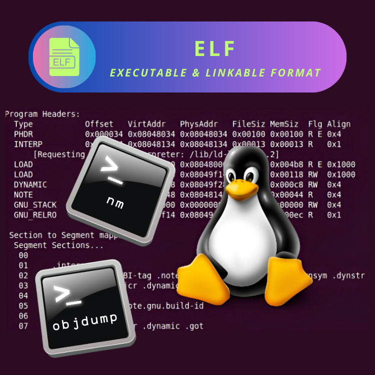

<div align="center">
<br>



</div>


<p align="center">


</p>


<h1 align="center"> C - ELF: nm/objdump </h1>


<h3 align="center">
<a href="https://github.com/RazikaBengana/holbertonschool-system_linux/tree/main/nm_objdump#eye-about">About</a> •
<a href="https://github.com/RazikaBengana/holbertonschool-system_linux/tree/main/nm_objdump#hammer_and_wrench-tasks">Tasks</a> •
<a href="https://github.com/RazikaBengana/holbertonschool-system_linux/tree/main/nm_objdump#memo-learning-objectives">Learning Objectives</a> •
<a href="https://github.com/RazikaBengana/holbertonschool-system_linux/tree/main/nm_objdump#computer-requirements">Requirements</a> •
<a href="https://github.com/RazikaBengana/holbertonschool-system_linux/tree/main/nm_objdump#keyboard-more-info">More Info</a> •
<a href="https://github.com/RazikaBengana/holbertonschool-system_linux/tree/main/nm_objdump#mag_right-resources">Resources</a> •
<a href="https://github.com/RazikaBengana/holbertonschool-system_linux/tree/main/nm_objdump#bust_in_silhouette-authors">Authors</a> •
<a href="https://github.com/RazikaBengana/holbertonschool-system_linux/tree/main/nm_objdump#octocat-license">License</a>
</h3>

---

<!-- ------------------------------------------------------------------------------------------------- -->

<br>
<br>

## :eye: About

<br>

<div align="center">

**`C - ELF: nm/objdump`** project implements custom versions of the `nm` and `objdump` utilities for analyzing `ELF` (_Executable and Linkable Format_) files.
<br>
The programs demonstrate how to extract and display symbol tables, section headers, and other crucial information from `ELF` files, providing insights into the structure and content of executable files.
<br>
<br>
This project has been created by **[Holberton School](https://www.holbertonschool.com/about-holberton)** to enable every student to understand how `ELF file structures` and `memory layouts` are implemented in C language.

</div>

<br>
<br>

<!-- ------------------------------------------------------------------------------------------------- -->

## :hammer_and_wrench: Tasks

<br>

**`0. nm`**

**`1. objdump -sf`**

**`2. Blog post`** 

<br>
<br>

<!-- ------------------------------------------------------------------------------------------------- -->

## :memo: Learning Objectives

<br>

**_You are expected to be able to [explain to anyone](https://fs.blog/feynman-learning-technique/), without the help of Google:_**

<br>

```diff

General

+ What is the ELF format

+ What are the commands nm and objdump

+ How to use them properly

+ How to parse the content of an ELF file

+ What information can be extracted from an ELF file

+ What are the differences between nm and objdump

```

<br>
<br>

<!-- ------------------------------------------------------------------------------------------------- -->

## :computer: Requirements

<br>

```diff

General

+ Allowed editors: vi, vim, emacs

+ All your files will be compiled on Ubuntu 20.04 LTS

+ Your C programs and functions will be compiled with gcc 9.4.0 using the flags -Wall -Werror -Wextra and -pedantic

+ All your files should end with a new line

+ A README.md file, at the root of the folder of the project, is mandatory

+ Your code should use the Betty style. It will be checked using betty-style.pl and betty-doc.pl

- You are not allowed to have more than 5 functions per file

+ All your header files should be include guarded


Allowed Functions and System Calls

+ Unless specified otherwise, you are allowed to use the C standard library

- You’re not allowed to use system(3)

- You’re not allowed to use exec* (2 and 3)


Compilation

+ You have to provide a Makefile in order to compile each task

+ Make sure each task compiles on Ubuntu 20.04 LTS, with gcc 9.4.0

+ You must compile each task using the flags -Wall -Werror -Wextra and -pedantic


Tests

+ Your program must be able to handle both 32-bit and 64-bit ELF files

+ Your program must be able to handle both little and big endian ELF files

+ Your program must be able to handle all types of ELF files

```

<br>

**_Why all your files should end with a new line? See [HERE](https://unix.stackexchange.com/questions/18743/whats-the-point-in-adding-a-new-line-to-the-end-of-a-file/18789)_**

<br>
<br>

<!-- ------------------------------------------------------------------------------------------------- -->

## :keyboard: More Info

<br>

- See also `/usr/include/elf.h`.

<br>
<br>

<!-- ------------------------------------------------------------------------------------------------- -->

## :mag_right: Resources

<br>

**_Do you need some help?_**

<br>

**Read or watch:**

* [ELF Wikipedia](https://en.wikipedia.org/wiki/Executable_and_Linkable_Format)

* [ELF](https://stevens.netmeister.org/631/elf.html)

* [The ELF Object File Format: Introduction](https://www.linuxjournal.com/article/1059)

* [The ELF Object File Format by Dissection](https://www.linuxjournal.com/article/1060)

<br>

**`man` or `help`:**

* `elf (5)`

* `nm (1)`

* `objdump (1)`

<br>
<br>

<!-- ------------------------------------------------------------------------------------------------- -->

## :bust_in_silhouette: Authors

<br>


<br>
<br>

<!-- ------------------------------------------------------------------------------------------------- -->

## :octocat: License

<br>

```C - ELF: nm/objdump``` _project has no license specified._

<br>
<br>

---

<p align="center"><br>2023</p>