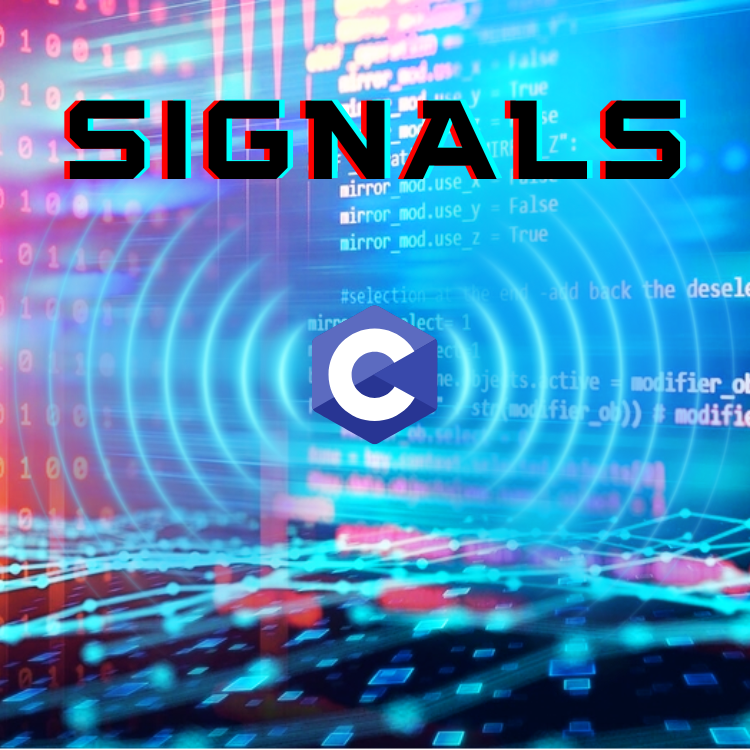

<div align="center">
<br>



</div>


<p align="center">


</p>


<h1 align="center"> C - Signals </h1>


<h3 align="center">
<a href="https://github.com/RazikaBengana/holbertonschool-system_linux/tree/main/signals#eye-about">About</a> •
<a href="https://github.com/RazikaBengana/holbertonschool-system_linux/tree/main/signals#hammer_and_wrench-tasks">Tasks</a> •
<a href="https://github.com/RazikaBengana/holbertonschool-system_linux/tree/main/signals#memo-learning-objectives">Learning Objectives</a> •
<a href="https://github.com/RazikaBengana/holbertonschool-system_linux/tree/main/signals#computer-requirements">Requirements</a> •
<a href="https://github.com/RazikaBengana/holbertonschool-system_linux/tree/main/signals#mag_right-resources">Resources</a> •
<a href="https://github.com/RazikaBengana/holbertonschool-system_linux/tree/main/signals#bust_in_silhouette-authors">Authors</a> •
<a href="https://github.com/RazikaBengana/holbertonschool-system_linux/tree/main/signals#octocat-license">License</a>
</h3>

---

<!-- ------------------------------------------------------------------------------------------------- -->

<br>
<br>

## :eye: About

<br>

<div align="center">

**`C - signals`** project focuses on implementing various signal handling functionalities in C programming.
<br>
The programs demonstrate setting up **signal handlers**, **sending signals between processes**, **managing signal sets**, and **controlling signal behavior**, providing hands-on experience with asynchronous event handling in Unix-like systems.
<br>
<br>
This project has been created by **[Holberton School](https://www.holbertonschool.com/about-holberton)** to enable every student to understand how `signal handling` and `process communication mechanisms` in C language work.

</div>

<br>
<br>

<!-- ------------------------------------------------------------------------------------------------- -->

## :hammer_and_wrench: Tasks

<br>

**`0. Handle signal`**

**`1. Current handler - signal`**

**`2. Gotta catch them all`**

**`3. Current handler - sigaction`**

**`4. Who said that?!`**

**`5. Description`**

**`6. Catch a single time`**

**`7. Sending a signal`**

**`8. Sending a signal in a shell`**

**`9. Catch with sh`**

**`10. Does it exist?`**

**`11. Blog post`** 

**`12. I'm saying it's unkillable.`**

**`13. Sigset`**

**`14. Block signals`**

**`15. Unblock signals`**

**`16. Handle pending signals`**

<br>
<br>

<!-- ------------------------------------------------------------------------------------------------- -->

## :memo: Learning objectives

<br>

**_You are expected to be able to [explain to anyone](https://fs.blog/feynman-learning-technique/), without the help of Google:_**

<br>

```diff

General

+ What is a signal

+ Why do they exist

+ When are they delivered and by whom

+ What are the default actions of signals

+ How to set up a handler for a signal

+ How to send signals

+ What signals can’t be caught

```

<br>
<br>

<!-- ------------------------------------------------------------------------------------------------- -->

## :computer: Requirements

<br>

```diff

General

+ Allowed editors: vi, vim, emacs

+ All your files will be compiled on Ubuntu 20.04 LTS

+ Your C programs and functions will be compiled with gcc 9.4.0 using the flags -Wall -Werror -Wextra and -pedantic

+ All your files should end with a new line

+ A README.md file, at the root of the folder of the project is mandatory

+ Your code should use the Betty style. It will be checked using betty-style.pl and betty-doc.pl

+ You are allowed to have more than 5 functions per file

+ The prototypes of all your functions should be included in your header file called signals.h

+ Don’t forget to push your header file

+ All your header files should be include guarded


Allowed functions and system calls

+ Unless specified otherwise in a task, you are allowed to use the C standard library

```

<br>

**_Why all your files should end with a new line? See [HERE](https://unix.stackexchange.com/questions/18743/whats-the-point-in-adding-a-new-line-to-the-end-of-a-file/18789)_**

<br>
<br>

<!-- ------------------------------------------------------------------------------------------------- -->

## :mag_right: Resources

<br>

**_Do you need some help?_**

<br>

**Read or watch:**

* [Signals](https://en.wikipedia.org/wiki/Signal_%28IPC%29)

* [Asynchrony](https://en.wikipedia.org/wiki/Asynchrony_%28computer_programming%29)

* [Signal sets](https://www.gnu.org/software/libc/manual/html_node/Signal-Sets.html)

<br>

**`man` or `help`:**

* `signal (7)`

* `signal (2)`

* `sigaction (2)`

* `kill (2)`

<br>
<br>

<!-- ------------------------------------------------------------------------------------------------- -->

## :bust_in_silhouette: Authors

<br>

**${\color{blue}Razika \space Bengana}$**

<br>
<br>

<!-- ------------------------------------------------------------------------------------------------- -->

## :octocat: License

<br>

```C - signals``` _project has no license specified._

<br>
<br>

---

<p align="center"><br>2023</p>