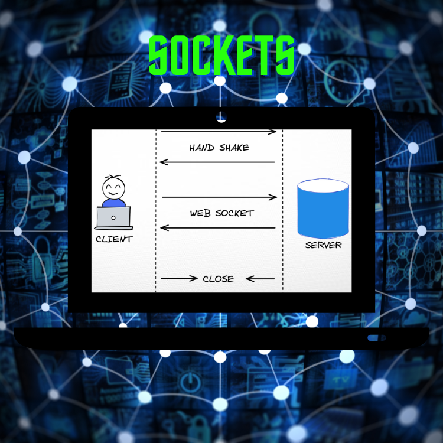

<div align="center">
<br>



</div>


<p align="center">


</p>

<h1 align="center"> Sockets </h1>


<h3 align="center">
<a href="https://github.com/RazikaBengana/holbertonschool-system_linux/tree/main/sockets#eye-about">About</a> •
<a href="https://github.com/RazikaBengana/holbertonschool-system_linux/tree/main/sockets#hammer_and_wrench-tasks">Tasks</a> •
<a href="https://github.com/RazikaBengana/holbertonschool-system_linux/tree/main/sockets#memo-learning-objectives">Learning Objectives</a> •
<a href="https://github.com/RazikaBengana/holbertonschool-system_linux/tree/main/sockets#computer-requirements">Requirements</a> •
<a href="https://github.com/RazikaBengana/holbertonschool-system_linux/tree/main/sockets#keyboard-more-info">More Info</a> •
<a href="https://github.com/RazikaBengana/holbertonschool-system_linux/tree/main/sockets#mag_right-resources">Resources</a> •
<a href="https://github.com/RazikaBengana/holbertonschool-system_linux/tree/main/sockets#bust_in_silhouette-authors">Authors</a> •
<a href="https://github.com/RazikaBengana/holbertonschool-system_linux/tree/main/sockets#octocat-license">License</a>
</h3>

---

<!-- ------------------------------------------------------------------------------------------------- -->

<br>
<br>

## :eye: About

<br>

<div align="center">

**`Sockets`** project dives into the implementation of network communication using `TCP sockets` in `C`.
<br>
The programs demonstrate server-client interactions, `HTTP` request handling, and management of a to-do list using linked data structures, all while focusing on proper socket creation, binding, and connection.
<br>
<br>
This project has been created by **[Holberton School](https://www.holbertonschool.com/about-holberton)** to enable every student to understand how `network programming` and `client-server architectures` in C language work.

</div>

<br>
<br>

<!-- ------------------------------------------------------------------------------------------------- -->

## :hammer_and_wrench: Tasks

<br>

**`0. Listen`**

**`1. Accept`**

**`2. Client`**

**`3. Roger`**

**`4. REST API - The Request`**

**`5. REST API - Queries`**

**`6. REST API - Headers`**

**`7. REST API - Body parameters`**

**`8. REST API - Create TODO`**

**`9. REST API - Retrieve all TODOs`**

**`10. REST API - Retrieve a single TODO`**

**`11. REST API - Delete a TODO`**

<br>
<br>

<!-- ------------------------------------------------------------------------------------------------- -->

## :memo: Learning Objectives

<br>

**_You are expected to be able to [explain to anyone](https://fs.blog/feynman-learning-technique/), without the help of Google:_**

<br>

```diff

General

+ What is a socket and how it is represented on a Linux/UNIX system

+ What are the different types of sockets

+ What are the different socket domains

+ How to create a socket

+ How to bind a socket to an address/port

+ How to listen and accept incoming traffic

+ How to connect to a remote application

+ What is the the HTTP protocol

+ How to create a simple HTTP server

```

<br>
<br>

<!-- ------------------------------------------------------------------------------------------------- -->

## :computer: Requirements

<br>

```diff

General

+ Allowed editors: vi, vim, emacs

+ All your files will be compiled on Ubuntu 20.04 LTS

+ Your C programs and functions will be compiled with gcc 9.* using the flags -Wall -Werror -Wextra and -pedantic

+ All your files should end with a new line

+ A README.md file, at the root of the folder of the project, is mandatory

+ Your code should use the Betty style. It will be checked using betty-style.pl and betty-doc.pl

- You are not allowed to have more than 5 functions per file

+ All your header files should be include guarded

+ Unless specified otherwise, you are allowed to use the C standard library

```

<br>

**_Why all your files should end with a new line? See [HERE](https://unix.stackexchange.com/questions/18743/whats-the-point-in-adding-a-new-line-to-the-end-of-a-file/18789)_**

<br>
<br>

<!-- ------------------------------------------------------------------------------------------------- -->

## :keyboard: More Info

<br>

- For the `REST API` part of this project, you can easily test your `HTTP` server, using `curl`, `Postman`, or even your browser …

- You are free to use any data structure that suits you as long as their purpose is well defined

<br>
<br>

### REST API:

<br>

- The goal of this project is to build a simple `HTTP REST API` in `C`.

- This is going to be a really simple API, allowing us to manage a list of things to do (a.k.a a **TODO list**). <br>
  Our database will be the `RAM`, meaning we won’t have any persistent storage. <br>
  It’s not the purpose of this project anyway. <br>
  Every time you start your server, the list of todos is empty.

<br>
<br>

- A `todo` contains at least the following fields:

    - `id` -> Positive integer, starting from `0`
    - `title` -> String
    - `description` -> String

<br>
<br>

- Here are the different routes that will have to be implemented:

    - `/todos`
        - `POST` -> Creates a new todo
        - `GET` -> Retrieve all the todos

    - `/todos?id={id}` (where `{id}` is a positive integer)
        - `GET` -> Retrieve the todo with the corresponding `id`
        - `DELETE` -> Delete the todo with the corresponding `id`

<br>
<br>

<!-- ------------------------------------------------------------------------------------------------- -->

## :mag_right: Resources

<br>

**_Do you need some help?_**

<br>

**Read or watch:**

* [Sockets - GNU](https://www.gnu.org/software/libc/manual/html_node/Sockets.html)

* [Sockets Programming in C](https://drive.google.com/file/d/12WuCxmyobCgicqxGjvNdWHmw88pVgfh7/view?usp=sharing)

* [List of HTTP status codes](https://en.wikipedia.org/wiki/List_of_HTTP_status_codes)

* [RFC 2616 -> HTTP 1.1](https://datatracker.ietf.org/doc/html/rfc2616)

<br>

**`man` or `help`:**

* `socket (2)`

* `bind (2)`

* `listen (2)`

* `accept (2)`

* `connect (2)`

* `send (2)`

* `recv (2)`

<br>
<br>

<!-- ------------------------------------------------------------------------------------------------- -->

## :bust_in_silhouette: Authors

<br>


<br>
<br>

<!-- ------------------------------------------------------------------------------------------------- -->

## :octocat: License

<br>

```Sockets``` _project has no license specified._

<br>
<br>

---

<p align="center"><br>2023</p>