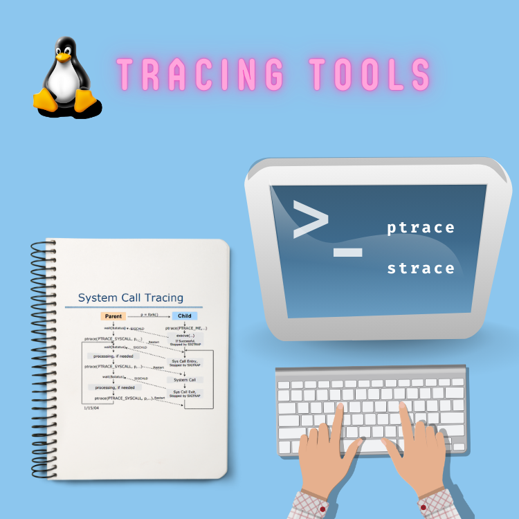

<div align="center">
<br>



</div>


<p align="center">


</p>


<h1 align="center"> C - Strace </h1>


<h3 align="center">
<a href="https://github.com/RazikaBengana/holbertonschool-system_linux/tree/main/strace#eye-about">About</a> •
<a href="https://github.com/RazikaBengana/holbertonschool-system_linux/tree/main/strace#hammer_and_wrench-tasks">Tasks</a> •
<a href="https://github.com/RazikaBengana/holbertonschool-system_linux/tree/main/strace#memo-learning-objectives">Learning Objectives</a> •
<a href="https://github.com/RazikaBengana/holbertonschool-system_linux/tree/main/strace#computer-requirements">Requirements</a> •
<a href="https://github.com/RazikaBengana/holbertonschool-system_linux/tree/main/strace#keyboard-more-info">More Info</a> •
<a href="https://github.com/RazikaBengana/holbertonschool-system_linux/tree/main/strace#mag_right-resources">Resources</a> •
<a href="https://github.com/RazikaBengana/holbertonschool-system_linux/tree/main/strace#bust_in_silhouette-authors">Authors</a> •
<a href="https://github.com/RazikaBengana/holbertonschool-system_linux/tree/main/strace#octocat-license">License</a>
</h3>

---

<!-- ------------------------------------------------------------------------------------------------- -->

<br>
<br>

## :eye: About

<br>

<div align="center">

**`C - strace`** project focuses on implementing programs that **trace system calls made by child processes**.
<br>
The programs use the `ptrace` system call to monitor and display the system call usage of other running processes.
<br>
<br>
This project has been created by **[Holberton School](https://www.holbertonschool.com/about-holberton)** to enable every student to understand how `system call tracing` and `process monitoring` in C language work.

</div>

<br>
<br>

<!-- ------------------------------------------------------------------------------------------------- -->

## :hammer_and_wrench: Tasks

<br>

**`0. Step #0 - Syscall number`**

**`1. Step #1 - Syscall name`**

**`2. Step #2 - Return value`**

**`3. Step #3 - Raw parameters`**

**`4. Step #4 - Strings`**

**`5. Step #5 - Integers`**

**`6. Step #6 - Macros`**

**`7. Step #7 - Buffer`**

**`8. Step #8 - Structure`**

<br>
<br>

<!-- ------------------------------------------------------------------------------------------------- -->

## :memo: Learning objectives

<br>

**_You are expected to be able to [explain to anyone](https://fs.blog/feynman-learning-technique/), without the help of Google:_**

<br>

```diff

General

+ What is strace, and what is its purpose

+ What is ptrace, and what possibilties it offers

+ What are the differences between PTRACE_SINGLESTEP and PTRACE_SYSCALL

+ How to read from and/or write to the memory of a process being traced

```

<br>
<br>

<!-- ------------------------------------------------------------------------------------------------- -->

## :computer: Requirements

<br>

```diff

General

+ Allowed editors: vi, vim, emacs

+ All your files will be compiled on Ubuntu 20.04 LTS

+ Your programs and functions will be compiled with gcc 9.4.0 using the flags -Wall -Werror -Wextra and -pedantic

+ All your files should end with a new line

+ A README.md file, at the root of the folder of the project, is mandatory

+ Your code should use the Betty style. It will be checked using betty-style.pl and betty-doc.pl

- You are not allowed to use global variables

+ No more than 5 functions per file

+ You are allowed to use the standard library

+ All your header files should be include guarded

+ In the examples given, please remember that some values may be specific to the computer they are tested on, especially for addresses

```

<br>

**_Why all your files should end with a new line? See [HERE](https://unix.stackexchange.com/questions/18743/whats-the-point-in-adding-a-new-line-to-the-end-of-a-file/18789)_**

<br>
<br>

<!-- ------------------------------------------------------------------------------------------------- -->

## :keyboard: More Info

<br>

### Data Structure:

<br>

- This project requires you to parse the files `/usr/include/asm/unistd_64.h` and `/usr/include/asm/unistd_32.h`, in order to get the number corresponding to each **syscall**.<br>
  It also requires you to do some **man-scraping** to get information about **syscalls prototypes**, in order to know the return type of each **syscall**, as well as its number of arguments and their type.

    - Since this is a very time-consuming task, you are given a [header file](https://github.com/hs-hq/0x0B-strace.c), containing all these informations, allowing you to focus on the `ptrace` part of this project.

<br>

- Please note that you are completely allowed to use your own data structure(s) and/or to modify the one provided to you, which is only here to help you getting started with `strace`, it does not contain everything you need for a complete `strace`.

<br>
<br>

<!-- ------------------------------------------------------------------------------------------------- -->

## :mag_right: Resources

<br>

**_Do you need some help?_**

<br>

**Concepts:**

* [[EYNTK] x86-64 Assembly](https://drive.google.com/file/d/12KpGcka1olPEPE_IgPqow4yMxlOTm7Ia/view?usp=sharing)

* [[EYNTK] Strace](https://drive.google.com/file/d/12IauyokdEZq2S0M0gElFqfmuzLBbkhyB/view?usp=sharing)

<br>

**Read or watch:**

* [Ptrace Tutorial](https://drive.google.com/file/d/12bMZwwuBHgoN-ijwH98OW7hdcLjBmGeE/view?usp=sharing)

* [How does ptrace work](https://stackoverflow.com/questions/23928530/how-does-ptrace-work-in-linux/23929059#23929059)

<br>

**`man` or `help`:**

* `strace`

* `ptrace`

<br>
<br>

<!-- ------------------------------------------------------------------------------------------------- -->

## :bust_in_silhouette: Authors

<br>

**${\color{blue}Razika \space Bengana}$**

<br>
<br>

<!-- ------------------------------------------------------------------------------------------------- -->

## :octocat: License

<br>

```C - strace``` _project has no license specified._

<br>
<br>

---

<p align="center"><br>2023</p>